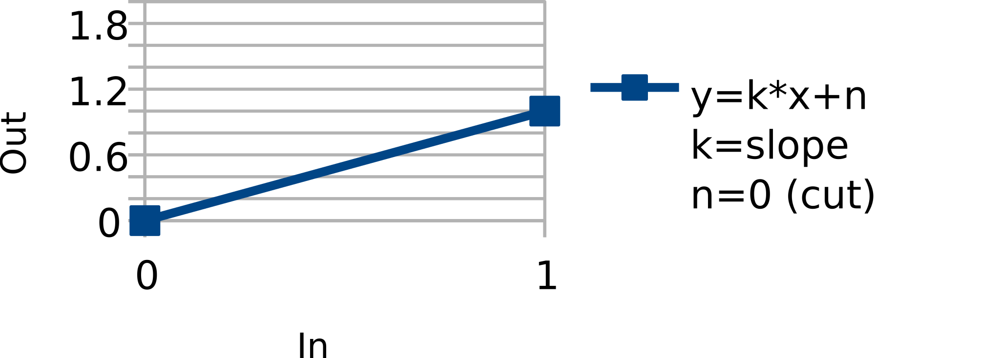
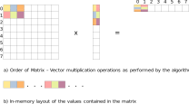
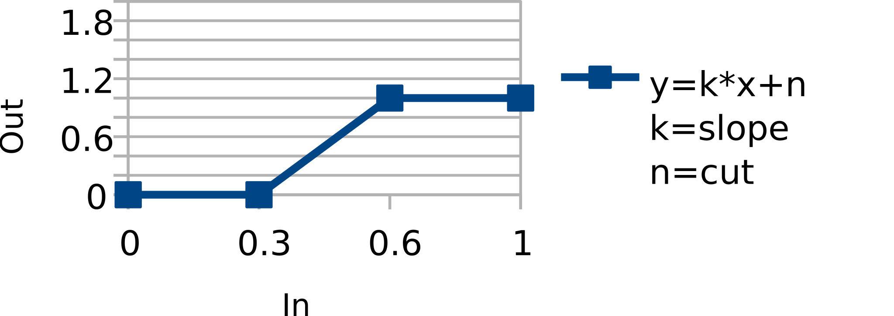
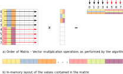
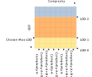

# RigLogic 4

## Overview

This document outlines the design of the next iteration of RigLogic, the runtime software component that is embeddable into various game engines and animation / modeling tools for controlling rigs. The tasks performed by RigLogic essentially boil down to the calculation of a set of output values (representing deformations) based on provided input values (representing expressions).

The following sections will describe the basic functionality provided by the current version of RigLogic, along with it's limitations and propose a solution with implementation details for the next version that is expected to overcome the said limitations.

## RigLogic (current version)

### Features

As mentioned in the overview, RigLogic performs a type of transformation on it's inputs, which can also be seen as a form of conversion from a higher-level representation into a lower-level representation (in this specific case the conversion of expressions into deformations). As such, the number of inputs and outputs doesn't necessarily match, in fact it most certainly never does.

- Inputs represent higher-level controls for specific expressions (e.g. in Maya, these are controls on the 2D interface for manipulating the rig - turning expressions on and off, while in case of game engines, these same controls are programmatically driven by higher-level animation systems)

- Outputs produced by RigLogic are joint transformations, blendshapes and animated mask multipliers, all of which at the very end have a common purpose of producing some delta values relative to the neutral pose of the object being animated

For the calculation of the above mentioned outputs, there are specific stages through which the input data needs to go through:

- PSD calculation
- Evaluation of linear dependent outputs
- Evaluation of conditional dependent outputs

Each stage description will be accompanied with the algorithm that performs it's respective calculation.

### PSD calculation

PSDs (Pose Space Deformations) are expressions that represent complex poses and how they are corrected. They define how multiple different expressions should be combined together. At this stage, the input vector is further populated with additional values that represent combined expressions which need to be turned on, and which will take effect in the next stage (see Alg.1).

!include incl/algorithm1

### Evaluation of linear dependent outputs

The linear input matrix contains SDKs (Set Driven Keys), which essentially describe all the possible expressions that can be applied to the object being animated, while the input vector controls which of these expressions will be utilized and with what intensity (see Fig.1). The algorithm that performs this calculation is in fact nothing else, but the well known SpMV algorithm, with a twist of some additional indirections (see Fig.2 and Alg.2).





!include incl/algorithm2

### Evaluation of conditional dependent outputs

Conditionals handle sequential expressions (i.e. a chain of expressions - see Fig.3). Their definition basically consists of specifying the parameters of the slope intercept form for different ranges of input values, where each range represents a stage in the sequence (see Alg.3). Conditionals occupy a very small percentage of the data overall (less than 3%), and they usually represent mask multipliers.



!include incl/algorithm3

### Limitations

The current version of RigLogic has chosen a uniform representation to encode all the information (joints, blendshapes and mask multipliers) needed for the calculation of the desired outputs. This representation achieved a sufficient level of data compression, while not requiring overly complex algorithms to perform the calculations, but at the same time it failed to take into account the following points:

- Efficient representation / storage of LODs (Level of Detail)

  By not taking into account LODs, a lot of data is duplicated within each distinct level of detail, which results in a significant, negative impact on the memory footprint. A smarter LOD storage strategy would be needed to overcome this issue.

- Utilization of cache-friendly data structures

  The current data structure representing linear matrices is the CRS (Compressed Row Storage) sparse matrix. As can be seen in the above shown algorithms, for the evaluation of a matrix stored in the CRS format, a lot of indirection is involved, particularly when accessing the right-hand-side values from the input vector (matching the corresponding values from the matrix). Such indirections cause a lot of cache misses and are the main bottlenecks of the algorithms.

- Effective vectorization of the algorithms involved

  This is a direct consequence of the earlier mentioned issue with the chosen data structure. As the CRS matrix stores non-zero values in row-major order, some naive form of vectorization is possible, although it isn't particularly effective, due to the way how the right-hand-side vector-register has to be filled with values from the input vector. Likewise, the reduction operation needed at the end of each row to sum up the values of the vector register is also significantly reducing the performance improvement that could otherwise be gained by vectorization.

- Matrix merging in GeneSplicer

  The operation of GeneSplicer requires multiple matrices to be merged (mixed) together. In order to do so however, the sparse matrices involved first need to be converted to dense matrices as they have different structures. This results in a significant memory overhead that cannot easily be avoided.

The next section explores how these problems could be solved.

## Solution Proposal

Overcoming the limitations described in the previous section requires a fundamental change of data structures and storage strategy. By exploiting domain specific knowledge, multiple improvements can be made to the existing solution:

- Matrix pruning
- Separation of logically distinct data types
- New data structure

### Matrix pruning

It is possible to prune the matrices in such a way to essentially get rid of actually undesirable data that incorrectly affects the results (although it's damage is insignificant). The pruning strategy is not a simple threshold-based clean-up, but it's based on a higher-level interpretation of the data itself, such that distinct joint-groups are not allowed to contain data that would affect regions which they are not expected to control. Such pruning reduces the overall amount of data that needs to be stored.

### Separation of logically distinct data types

The linear matrix mentioned in the previous section stored multiple distinct data types (joint groups, blendshapes and mask multipliers) together in the same matrix. Incidentally, blendshapes are always grouped at the bottom of these linear matrices, where they form a diagonal sub-matrix. This presents an opportunity to extract and store them in a separate data structure, in form of a simple injective mapping. Likewise, mask multipliers can be extracted and be made part of the conditional matrix, which leaves joint groups alone in the linear matrix.

### New data structure

Any sparse matrix pruned and separated as described above can be conveniently partitioned into densely populated sub-matrices. The positions of these sub-matrices are uniform among all the matrices, which further generalizes the approach. To exploit the existence of these dense sub-matrices however, the CRS format must be abandoned in favor of a format that lends itself to these properties, and which will be covered in detail in the implementation section.

### Implications

All these improvements have higher-level implications as well. As each dense sub-matrix represents a distinct joint group and their positions are uniform within linear matrices of different animated objects (i.e. characters), a persistent mapping can be established between rig controls and joint groups, which essentially describes which controls affect which joint groups. Consequently, the fixed positions of joint groups also solve the issue of matrix merging that happens in _GeneSplicer_, which will no longer require the conversion of sparse into dense matrices.

In addition to the changes described so far, some entirely new concepts are being introduced in the new version as well:

- LOD (Level of Detail) handling
- Max-LOD
- Complexity

### LOD (Level of Detail) handling

Earlier versions of RigLogic had somewhat ignored the problem of LODs (as mentioned already), which negatively impacted their memory footprint, because each level duplicated the data from all the levels that logically could be perceived as their strict subsets.

The first (zero-indexed) level of detail is expected to provide the most precise control over rigs, with each subsequent level reducing this precision. As a result, higher levels should require less in-memory data and they should also significantly reduce the number of computations that must be performed.

To achieve this however, some changes are needed to the way the joint hierarchy is built up, such that joint groups belonging to a higher level must become a strict subset of the level that precedes them. Organized this way, the data duplication issue could easily be solved by making the higher-precision levels inherit the already present data from the lower-precision levels.

### Max-LOD

This is an optional optimization technique that would allow clients to specify the maximum level of detail that they expect to use, before the data is even loaded. Utilization of this option could provide significant speed-ups in loading times.

### Complexity

Complexity as a parameter stands for the number of rig control interfaces. As such, increasing the complexity would mean increasing the number of inputs, while decreasing the complexity would likewise decrease the number of inputs. In a similar way to LODs, complexity directly affects the amount of computation that needs to be performed during the evaluation of the linear matrix.

## Implementation

Implementation details (just as the design itself) are still a work in progress, so anything described here is subject to possible major changes.

### Data structure

As mentioned in the preceding section, the CRS format must be dropped in favor of a format that can exploit the existence of dense sub-matrices in the structure of the sparse matrix. As such, a variable-block sparse matrix representation was chosen, where the dense sub-matrices are stored in block-partitioned, column-major order (see Fig.4). The reasons for storing values in this specific order are:

- elimination of the per-row reduction step that was needed before
- improved pipelining
- support for bulk stores of the results

The only requirement is that the row count of these dense sub-matrices must be an integral multiple of the chosen block size (in this case 4, which matches the SSE vector register size), otherwise they must be padded with zeros. Although this might sound counter-effective, our tests showed that such padding has very minimal memory overhead (~2.5% over the whole sparse matrix).



From the definition of the data structure that follows, it can be seen that the floating point data is laid out contiguously, followed by some auxiliary metadata for the interpretation of the sparse matrix structure.

```c++
struct Extent
{
    uint16_t rows;
    uint16_t cols;
};

struct BlockSparseMatrix
{
    // All non-zero values
    float* values;
    // Dimensions of dense sub-matrices
    Extent* subMatrices;
    // Sub-matrix col -> input vector
    uint16_t* inputIndices;
    // Sub-matrix row -> output vector
    uint16_t* outputIndices;
    uint32_t valueCount;
    uint16_t subMatrixCount;
    uint32_t inputIndexCount;
    uint32_t outputIndexCount;
    uint16_t rows;
    uint16_t cols;
};
```

The new data structure is cache-friendly and allows straightforward vectorization of the code that needs to process it. Additionally, parallelization also becomes a viable option with the approach, as individual sub-matrices, or even ranges of sub-matrices can be easily divided between multiple threads.

### Algorithm

The new algorithm that evaluates the improved data structure is still an ordinary SpMV algorithm, only it is fine-tuned through extensive profiling and analysis of the generated assembly code to perform significantly better than the earlier version. At this moment, it is almost 6x faster than the original version (see Alg.4).

!include incl/algorithm4

### LOD

As already explained, the new LOD storage strategy will organize levels in such a way that the more detailed levels will directly extend the less detailed levels that follow them. From the perspective of raw data within the sparse matrix, LODs will be laid out vertically in the matrix, with the whole matrix representing the most precise LOD, and by vertically slicing the matrix on predetermined positions, the level of detail can be reduced (see Fig.5). As such, once the data is loaded, switching between different LODs should become an extremely fast operation, that should involve only some pointer / boundary manipulation.

It must be noted however that, should it become necessary to access LODs that were not loaded previously, due to the earlier specified _Max-LOD_ parameter, a full reload of the data would be mandatory, which is an expensive operation.

### Complexity

Looking at it from the perspective of the sparse matrix again, each column of the matrix represents a single control (with a matching value under the same index in the input vector), therefore, complexity reduction or increase would involve deletion or addition of arbitrary columns, respectively (see Fig.5). Since a general ordering of rig controls / inputs that would allow partitioning them similarly as LODs cannot really be established, this is no longer a simple slicing operation.

In the absence of the aforementioned ordering, a change of complexity should be considered an expensive operation, and should never happen in performance-sensitive areas of the code, but in earlier stages of the runtime, such as during an initialization phase.



!include incl/onecol

## Appendix A: Algorithm Implementations in C++

### PSD calculation

```c++
void CpuRigLogic::evaluatePsdInputs(const UfcMath::SparseMatrix<float>& psdMatrix,
                                    UFCExtendedBuffer::InBuffer* inBuffer) const {
    float* inputData = inBuffer->getData();
    float* inputPsd = inBuffer->getPsds();

    uint32_t currentIndex = 0;
    for (uint32_t i = 0; i < psdMatrix.rowsSize.size(); ++i) {
        float psdVal = 1.0f;
        for (uint32_t j = 0; j < psdMatrix.rowsSize[i]; ++j) {
            uint32_t colIndex = currentIndex + j;
            float psdValue = psdMatrix.values[colIndex];
            float inputValue = inputData[psdMatrix.columnIndices[colIndex]];
            float product = psdValue * inputValue;
            psdVal *= (std::min)(PSD_MAX_VALUE, product);
        }
        inputPsd[i] = psdVal;
        currentIndex += psdMatrix.rowsSize[i];
    }
}
```

### Evaluation of linear dependent outputs

```c++
void CpuRigLogic::evaluateLinearOutputs(const UfcMath::SparseMatrix<float>& linearMatrix,
                                        const IntArray& linearIndices,
                                        UFCExtendedBuffer::InBuffer* inBuffer,
                                        float* outputs) const {
    float* inputData = inBuffer->getData();

    uint32_t currentIndex = 0u;
    for (uint32_t i = 0u; i < linearMatrix.rowsSize.size(); ++i) {
        float outVal = 0.0f;
        for (uint32_t j = 0u; j < linearMatrix.rowsSize[i]; ++j) {
            uint32_t colIndex = currentIndex + j;
            float slopeValue = linearMatrix.values[colIndex];
            float inputValue = inputData[linearMatrix.columnIndices[colIndex]];
            outVal += slopeValue * inputValue;
        }
        outputs[linearIndices[i]] += outVal;
        currentIndex += linearMatrix.rowsSize[i];
    }
}
```

### Evaluation of conditional dependent outputs

```c++
void CpuRigLogic::evaluateConditionalOutputs(const IntArray& inIndices,
                                             const IntArray& outIndices,
                                             const FloatArray& values,
                                             UFCExtendedBuffer::InBuffer* inBuffer,
                                             float* outputs) const {
    float* inputData = inBuffer->getData();

    uint32_t currentIndex = 0u;
    for (uint32_t i = 0u; i < outIndices.size(); ++i) {
        int32_t inputId = inIndices[i];
        float inValue = inputData[inputId];
        float fromValue = values[currentIndex + CONDITIONAL_MATRIX_FROM_VALUE_INDEX];
        float toValue = values[currentIndex + CONDITIONAL_MATRIX_TO_VALUE_INDEX];

        if ((inValue > fromValue) && (inValue <= toValue)) {
            int32_t outputId = outIndices[i];
            float slope = values[currentIndex + CONDITIONAL_MATRIX_SLOPE_VALUE_INDEX];
            float cut = values[currentIndex + CONDITIONAL_MATRIX_CUT_VALUE_INDEX];
            outputs[outputId] += slope * inValue + cut;
        }
        currentIndex += CONDITIONAL_MATRIX_COLUMNS_SIZE;
    }
}
```

### Block-vectorized evaluation of linear dependent outputs

```c++
void evaluateLinearOutputsBlockVectorized(const BlockSparseMatrix& matrix,
                                          float* inputs,
                                          float* outputs)
{
    constexpr uint16_t blkSize = 4u;
    constexpr uint16_t horizontalChunkSize = 8u;

    const float* values = matrix.values;
    const uint16_t* inputIndices = matrix.inputIndices;
    const uint16_t* outputIndices = matrix.outputIndices;
    for (const Extent* sm = matrix.subMatrices;
         sm != matrix.subMatrices + matrix.subMatrixCount;
         ++sm)
    {
        const uint16_t* outputIndicesEnd = outputIndices + sm->rows;
        const uint16_t* inputIndicesEnd = inputIndices + sm->cols;
        const uint16_t* inputIndicesAlignedEnd = (inputIndicesEnd -
            (sm->cols % horizontalChunkSize));
        for (; outputIndices < outputIndicesEnd; outputIndices += blkSize)
        {
            __m128 sum1 = _mm_setzero_ps();
            __m128 sum2 = _mm_setzero_ps();
            __m128 sum3 = _mm_setzero_ps();
            __m128 sum4 = _mm_setzero_ps();
            __m128 sum5 = _mm_setzero_ps();
            __m128 sum6 = _mm_setzero_ps();
            __m128 sum7 = _mm_setzero_ps();
            __m128 sum8 = _mm_setzero_ps();
            const uint16_t* inputIndicesCurrent = inputIndices;
            for (; inputIndicesCurrent < inputIndicesAlignedEnd;
                 inputIndicesCurrent += horizontalChunkSize,
                 values += blkSize * horizontalChunkSize)
            {
                __m128 inputVec1 = _mm_set_ps1(inputs[inputIndicesCurrent[0]]);
                __m128 inputVec2 = _mm_set_ps1(inputs[inputIndicesCurrent[1]]);
                __m128 inputVec3 = _mm_set_ps1(inputs[inputIndicesCurrent[2]]);
                __m128 inputVec4 = _mm_set_ps1(inputs[inputIndicesCurrent[3]]);
                __m128 inputVec5 = _mm_set_ps1(inputs[inputIndicesCurrent[4]]);
                __m128 inputVec6 = _mm_set_ps1(inputs[inputIndicesCurrent[5]]);
                __m128 inputVec7 = _mm_set_ps1(inputs[inputIndicesCurrent[6]]);
                __m128 inputVec8 = _mm_set_ps1(inputs[inputIndicesCurrent[7]]);
                __m128 blk1 = _mm_loadu_ps(values);
                __m128 blk2 = _mm_loadu_ps(values + blkSize);
                __m128 blk3 = _mm_loadu_ps(values + blkSize * 2);
                __m128 blk4 = _mm_loadu_ps(values + blkSize * 3);
                __m128 blk5 = _mm_loadu_ps(values + blkSize * 4);
                __m128 blk6 = _mm_loadu_ps(values + blkSize * 5);
                __m128 blk7 = _mm_loadu_ps(values + blkSize * 6);
                __m128 blk8 = _mm_loadu_ps(values + blkSize * 7);
                sum1 = _mm_add_ps(sum1, _mm_mul_ps(blk1, inputVec1));
                sum2 = _mm_add_ps(sum2, _mm_mul_ps(blk2, inputVec2));
                sum3 = _mm_add_ps(sum3, _mm_mul_ps(blk3, inputVec3));
                sum4 = _mm_add_ps(sum4, _mm_mul_ps(blk4, inputVec4));
                sum5 = _mm_add_ps(sum5, _mm_mul_ps(blk5, inputVec5));
                sum6 = _mm_add_ps(sum6, _mm_mul_ps(blk6, inputVec6));
                sum7 = _mm_add_ps(sum7, _mm_mul_ps(blk7, inputVec7));
                sum8 = _mm_add_ps(sum8, _mm_mul_ps(blk8, inputVec8));
            }
            for (; inputIndicesCurrent < inputIndicesEnd;
                 ++inputIndicesCurrent,
                 values += blkSize)
            {
                __m128 inputVec = _mm_set_ps1(inputs[*inputIndicesCurrent]);
                __m128 blk = _mm_loadu_ps(values);
                sum1 = _mm_add_ps(sum1, _mm_mul_ps(blk, inputVec));
            }
            sum1 = _mm_add_ps(sum1, sum2);
            sum3 = _mm_add_ps(sum3, sum4);
            sum5 = _mm_add_ps(sum5, sum6);
            sum7 = _mm_add_ps(sum7, sum8);
            sum1 = _mm_add_ps(sum1, sum3);
            sum5 = _mm_add_ps(sum5, sum7);
            sum1 = _mm_add_ps(sum1, sum5);

            float outbuf[blkSize];
            _mm_storeu_ps(outbuf, sum1);
            outputs[outputIndices[0]] += outbuf[0];
            outputs[outputIndices[1]] += outbuf[1];
            outputs[outputIndices[2]] += outbuf[2];
            outputs[outputIndices[3]] += outbuf[3];
        }
        inputIndices = inputIndicesEnd;
    }
}
```
